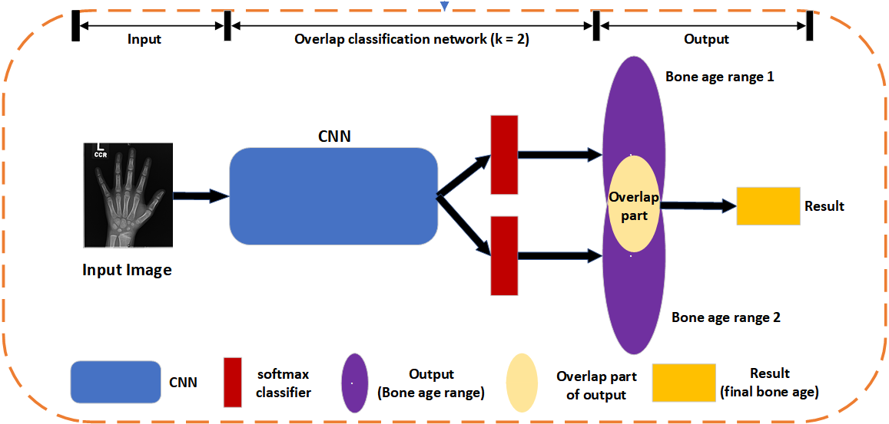
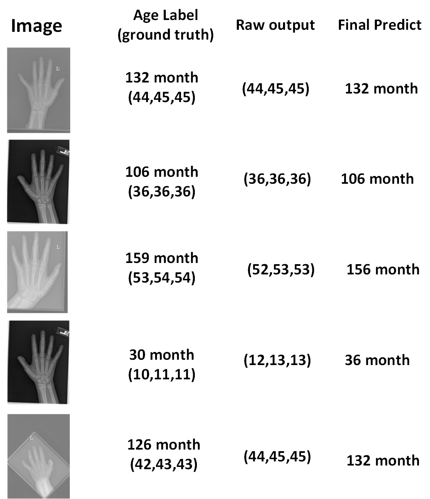
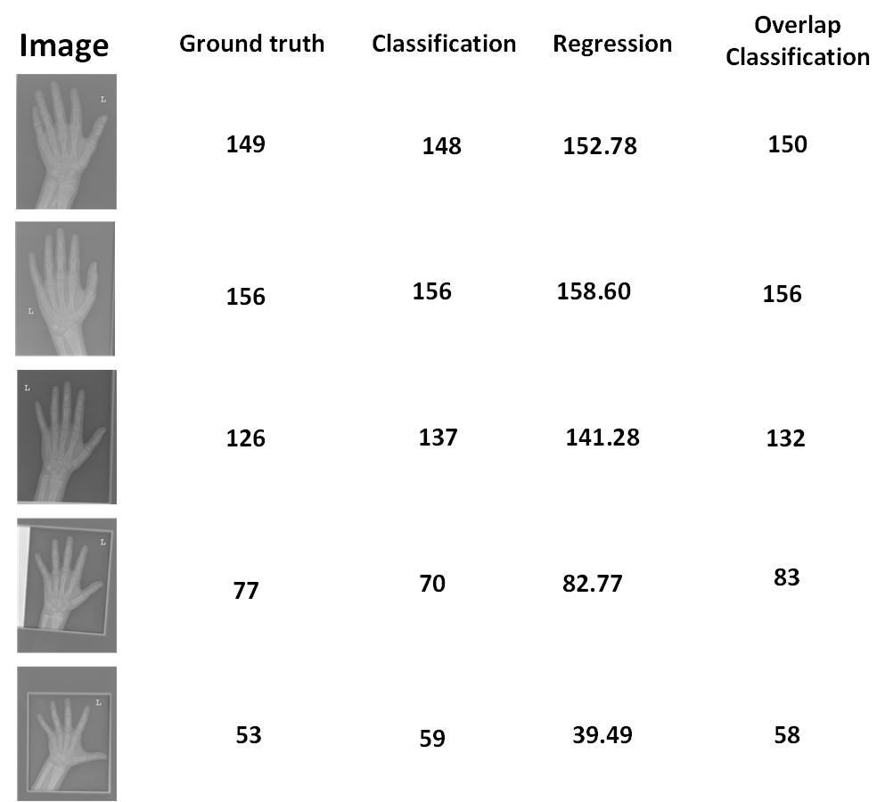

# OCNforBAA
Overlap Classification Network for Skeletal Bone Age Assessment.

This work not designed a new network architecture, but proposaled a new classification method. The most important contribution of this work is a label pre-processing concept and a new loss function for BAA. This work also has implications for solving other classification or regression problems.

The work used a calssic CNN inception-v3 and based on a public database RSNA. These codes only offer one implemention way to achieve overlap classification, and its not the unique way to achieve overlap classification.

### Abstract
In nature, the bone development of children is a continuous process. And in bone age assessment, the bone age labels are usually used to represent some certain bone ages. Strictly speaking, these labels are discrete. This, inevitably, causes a semantic gap between actual situation and label representation scope. Recently, many automated assessment methods have been proposed, but all of them ignored this semantic gap problem. In this paper, we present a novel method to reduce bad effects caused by the semantic gap in bone age assessment. In our method, bone age labels (0-228 month), which can be considered as a sequence, is used to generate a series of subsequences. And there are overlapping parts between adjacent subsequences. Then these overlapping parts are used to replace those original bone age labels. For bone age assessment, we let a network output several bone age ranges at the same time for one case. Then the overlapping part of these age ranges is considered as the final predicted bone age result. 
### Overview
#### Here gives an overview when we use 2 bone age range labels to replace an original bone age label. (It is k = 2)

#### In Our experiment we adopt k = 3 (use 3 bone age range labels to replace an original bone age label)
### Experiment samples
#### Some Output examples are shown below

#### Some results comparison between this work and traditional method are shown bellow.

